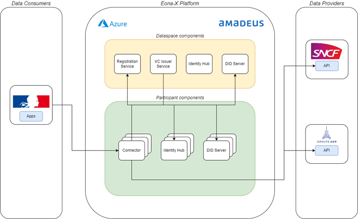

# Eona-X Connector - User Manual

## Eona-X platform overview



## Prerequisites

In order to complete this guide, you will need few infos that will be provided by Amadeus:

- the base url for targeting your respective connector, referred as `<CONNECTOR_URL>` hereafter,
- the base url for targeting the federated catalog, referred as `<CATALOG_URL>` hereafter,
- a token for authenticating to your respective connector APIs
- a token for authenticating to the dataspace federated catalog

## Steps for a participant to create a new dataset

All queries detailed in this section are based on the Swagger specification of the Management API of the EDC connector.

They require a `x-api-key` header in input containing the token provided by Amadeus to interact with your connector.

### Create dataset

#### Url

```bash
<CONNECTOR_URL>/cp/mgmt/v3/assets (POST)
```

#### Request body for a REST API with an API key stored in the connector Vault:

```json
{
  "@context": {
    "@vocab": "https://w3id.org/edc/v0.0.1/ns/"
  },
  "@id": "my-asset-id",
  "properties": {
    "name": "Test Asset",
    "description": "A fancy test asset",
    "contenttype": "application/json",
    "version": "1.0"
  },
  "dataAddress": {
    "type": "HttpData",
    "baseUrl": "https://your-api-url.com",
    "authKey": "Authorization",
    // alias of the Vault entry containing the access token
    "secretName": "my-secret"
  }
}
```

#### Request body for a REST API with API passed as query parameter:

```json
{
  "@context": {
    "@vocab": "https://w3id.org/edc/v0.0.1/ns/"
  },
  "@id": "my-asset-id",
  "properties": {
    "name": "Test Asset",
    "description": "A fancy test asset",
    "contenttype": "application/json",
    "version": "1.0"
  },
  "dataAddress": {
    "type": "HttpData",
    "baseUrl": "https://your-api-url.com",
    "queryParams": "projectId=my-project-id&authKey=my-token"
  }
}
```

#### Request body for a REST API with an Oauth2 authentication and private key stored in the connector Vault:

```json
{
  "@context": {
    "@vocab": "https://w3id.org/edc/v0.0.1/ns/"
  },
  "@id": "my-asset-id",
  "properties": {
    "name": "Test Asset",
    "description": "A fancy test asset",
    "contenttype": "application/json",
    "version": "1.0"
  },
  "dataAddress": {
    "type": "HttpData",
    "baseUrl": "https://your-api-url.com",
    "oauth2:clientId": "your-client-id",
    "oauth2:tokenUrl": "http://your-oauth2-server/token",
    "oauth2:privateKeyName": "private-key-alias"
  }
}
```

It is worth mentioning that the structure of the request to create a new dataset is composed of two sections:

- the properties which are the public metadata of the dataset and are displayed in the catalog
- the dataAddress which contains the information (e.g. url, token…) used by the provider connector to fetch the data
  from the data source → the data address is private and thus is not readable by the other participants!

#### Response

If the request is successful, then a code 200 will be returned along with a body containing the id of the dataset:

```json
{
  "@type": "IdResponse",
  "@id": "hello-eonax",
  "createdAt": 1703167675052,
  "@context": {
    "@vocab": "https://w3id.org/edc/v0.0.1/ns/",
    "edc": "https://w3id.org/edc/v0.0.1/ns/",
    "eonax": "https://w3id.org/eonax/v0.0.1/ns/",
    "odrl": "http://www.w3.org/ns/odrl/2/"
  }
}
```

### Create secret

If the dataset defined at the previous steps includes a secret within its data address (see secretName and oauth2:
privateKeyName in the examples above), then you need to add the corresponding secret within the connector Vault.

#### Url

```bash
<CONNECTOR_URL>/cp/mgmt/v3/secrets (POST)
```

#### Request body

```json
{
  "@context": {
    "@vocab": "https://w3id.org/edc/v0.0.1/ns/"
  },
  "@type": "Secret",
  "@id": "my-secret",
  "value": "e47bc29c-4839-40e7-967f-46968f83c36d"
}
```

#### Response

If the request is successful, then a code 200 will be returned along with a body containing the id of the secret:

```json
{
  "@type": "IdResponse",
  "@id": "my-secret",
  "createdAt": 1703167675052,
  "@context": {
    "@vocab": "https://w3id.org/edc/v0.0.1/ns/",
    "edc": "https://w3id.org/edc/v0.0.1/ns/",
    "eonax": "https://w3id.org/eonax/v0.0.1/ns/",
    "odrl": "http://www.w3.org/ns/odrl/2/"
  }
}
```

### Create policy

#### Url

```bash
<CONNECTOR_URL>/cp/mgmt/v3/policydefinitions (POST)
```

#### Request body for policy limiting access to Eona-X participants (i.e. all entities having a `MembershipCredential`)

```json
{
  "@context": {
    "@vocab": "https://w3id.org/edc/v0.0.1/ns/"
  },
  "@id": "eonax-members-only",
  "@type": "PolicyDefinitionDto",
  "policy": {
    "@context": "http://www.w3.org/ns/odrl.jsonld",
    "@type": "http://www.w3.org/ns/odrl/2/Set",
    "permission": [
      {
        "action": "use",
        "constraint": {
          "@type": "Constraint",
          "leftOperand": "MembershipCredential",
          "operator": "odrl:eq",
          "rightOperand": "active"
        }
      }
    ]
  }
}
```

#### Request body for policy limiting access to Eona-X participants and for a period of 365 days after contract signature

```json
{
  "@context": {
    "@vocab": "https://w3id.org/edc/v0.0.1/ns/"
  },
  "@id": "eonax-members-only-365d",
  "@type": "PolicyDefinitionDto",
  "policy": {
    "@context": "http://www.w3.org/ns/odrl.jsonld",
    "@type": "http://www.w3.org/ns/odrl/2/Set",
    "permission": [
      {
        "action": "use",
        "constraint": {
          "@type": "Constraint",
          "leftOperand": "MembershipCredential",
          "operator": "odrl:eq",
          "rightOperand": "active"
        }
      },
      {
        "action": "use",
        "constraint": {
          "@type": "Constraint",
          "leftOperand": "https://w3id.org/edc/v0.0.1/ns/inForceDate",
          "operator": "lteq",
          "rightOperand": "contractAgreement+365d"
        }
      }
    ]
  }
}
```

Note that the contract validity duration can be expressed in days `d`, hours `h`, minutes `m` or seconds `s`.

#### Request body for policy limiting access to participant with id `eonaxtest` and before the 25 déc. 2024.

```json
{
  "@context": {
    "@vocab": "https://w3id.org/edc/v0.0.1/ns/"
  },
  "@id": "eonax-members-only-365d",
  "@type": "PolicyDefinitionDto",
  "policy": {
    "@context": "http://www.w3.org/ns/odrl.jsonld",
    "@type": "http://www.w3.org/ns/odrl/2/Set",
    "permission": [
      {
        "action": "use",
        "constraint": {
          "@type": "Constraint",
          "leftOperand": "MembershipCredential",
          "operator": "odrl:eq",
          "rightOperand": "active"
        }
      },
      {
        "action": "use",
        "constraint": {
          "@type": "Constraint",
          "leftOperand": "https://w3id.org/edc/v0.0.1/ns/inForceDate",
          "operator": "lteq",
          "rightOperand": "2024-12-25T00:00:01Z"
        }
      },
      {
        "action": "use",
        "constraint": {
          "@type": "Constraint",
          "leftOperand": "GenericClaim.$.name",
          "operator": "eq",
          "rightOperand": "eonaxtest"
        }
      }
    ]
  }
}
```

The limit contract validity date is expressed in ISO-8061 UTC. Please refer to the appendix section for the known
participant ids

#### Response

If the request is successful, then a code 200 will be returned along with a body containing the id of the policy:

```json
{
  "@type": "IdResponse",
  "@id": "eonax-members-only",
  "createdAt": 1703167855896,
  "@context": {
    "@vocab": "https://w3id.org/edc/v0.0.1/ns/",
    "edc": "https://w3id.org/edc/v0.0.1/ns/",
    "eonax": "https://w3id.org/eonax/v0.0.1/ns/",
    "odrl": "http://www.w3.org/ns/odrl/2/"
  }
}
```

### Create contract definition

#### Url

```bash
<CONNECTOR_URL>/cp/mgmt/v3/contractdefinitions (POST)
```

#### Request body

```json
{
  "@context": {
    "@vocab": "https://w3id.org/edc/v0.0.1/ns/"
  },
  "@type": "https://w3id.org/edc/v0.0.1/ns/ContractDefinition",
  "accessPolicyId": "eonax-members-only",
  "contractPolicyId": "eonax-members-only",
  "assetsSelector": [
    {
      "@type": "Criterion",
      "operandLeft": "https://w3id.org/edc/v0.0.1/ns/id",
      "operator": "=",
      "operandRight": "my-asset-id"
    }
  ]
}
```

#### Response

If the request is successful, then a code 200 will be returned along with a body containing the id of the contract
definition:

```json
{
  "@type": "IdResponse",
  "@id": "1c6e191e-84bf-4640-b41b-f9ba717e9712",
  "createdAt": 1703167892881,
  "@context": {
    "@vocab": "https://w3id.org/edc/v0.0.1/ns/",
    "edc": "https://w3id.org/edc/v0.0.1/ns/",
    "eonax": "https://w3id.org/eonax/v0.0.1/ns/",
    "odrl": "http://www.w3.org/ns/odrl/2/"
  }
}
```

## Discovery, negotiation and usage of a dataset

This section is not correlated with the first one, i.e. we are not using the dataset created in the first section.
All APIs from this section requires a x-api-key header in input containing the token provided by Amadeus to interact
with the dataspace federated catalog.

### Federated catalog

#### Url

```bash
<CATALOG_URL>/catalog/mgmt/v1alpha/catalog/query (POST)
```

No request body is required.

#### Response

The response is a list of catalog (one catalog per Eona-X participant). A test participant called `eonaxtest` whose
respective catalog is depicted below.

```json
{
  "@id": "bea94ccf-b582-4c0c-8369-e2787990df86",
  "@type": "http://www.w3.org/ns/dcat#Catalog",
  "https://w3id.org/dspace/v0.8/participantId": "did:web:eonaxtest-identityhub%3A8383:api:did",
  "http://www.w3.org/ns/dcat#dataset": {
    "@id": "hello-eonax",
    "@type": "http://www.w3.org/ns/dcat#Dataset",
    "odrl:hasPolicy": {
      "@id": "YTM1MjcyOWUtYmY3Ny00MDkxLWFkZGUtZWE2YmJkZDFlMTNj:aGVsbG8tZW9uYXg=:MWVjMjJjY2MtMGEyMi00OTU4LTliZDctNDU4NWFjYmE5ZDgz",
      "@type": "odrl:Offer",
      "odrl:permission": {
        "odrl:action": {
          "odrl:type": "http://www.w3.org/ns/odrl/2/use"
        },
        "odrl:constraint": {
          "odrl:leftOperand": "https://w3id.org/edc/v0.0.1/ns/MembershipCredential",
          "odrl:operator": {
            "@id": "odrl:eq"
          },
          "odrl:rightOperand": "active"
        }
      },
      "odrl:prohibition": [],
      "odrl:obligation": []
    },
    "http://www.w3.org/ns/dcat#distribution": {
      "@type": "http://www.w3.org/ns/dcat#Distribution",
      "http://purl.org/dc/terms/format": {
        "@id": "HttpData-PULL"
      },
      "http://www.w3.org/ns/dcat#accessService": {
        "@id": "76c141c1-6f2f-4704-bfa1-fcf734652b25",
        "@type": "http://www.w3.org/ns/dcat#DataService"
      }
    },
    "version": "1.0",
    "name": "Hello Eona-X",
    "description": "An API that says hello to Eona-X",
    "id": "hello-eonax",
    "contenttype": "application/json"
  },
  "http://www.w3.org/ns/dcat#service": {
    "@id": "76c141c1-6f2f-4704-bfa1-fcf734652b25",
    "@type": "http://www.w3.org/ns/dcat#DataService",
    "http://www.w3.org/ns/dcat#endpointDescription": "dspace:connector",
    "http://www.w3.org/ns/dcat#endpointUrl": "http://eonaxtest-controlplane:8282/api/dsp",
    "http://purl.org/dc/terms/terms": "dspace:connector",
    "http://purl.org/dc/terms/endpointUrl": "http://eonaxtest-controlplane:8282/api/dsp"
  },
  "originator": "http://eonaxtest-controlplane:8282/api/dsp",
  "participantId": "did:web:eonaxtest-identityhub%3A8383:api:did",
  "@context": {
    "@vocab": "https://w3id.org/edc/v0.0.1/ns/",
    "edc": "https://w3id.org/edc/v0.0.1/ns/",
    "odrl": "http://www.w3.org/ns/odrl/2/"
  }
}
```

This catalog contains a `dataset` field that contains the list of datasets exposed by this
provider. For the `eonaxtest` participant, there is one dataset in this list whose id is `hello-eonax`.
In the following section, we will demonstrate how to request the access to this dataset using the connector APIs, and
finally how to consume the data represented by this dataset.

## Contract negotiation and data transfer

This section is not correlated with the first one, i.e. we are not using the dataset created in the first section.
All queries detailed in this section are based on the Swagger specification of the Management API of the EDC connector.
All APIs from this section requires a `x-api-key` header in input containing the token provided by Amadeus to interact
with your connector.

### Contract negotiation

In order to request access to this dataset, we first need to perform a JSON-LD compaction of the catalog response. The
compacted structure can be obtained simply by copying the content of the catalog into the JSON-LD playground. Then
extract the content of the `hasPolicy` field for the `hello-eonax` dataset in the compacted
structure, which should look similar to:

```json
{
  "@id": "YTM1MjcyOWUtYmY3Ny00MDkxLWFkZGUtZWE2YmJkZDFlMTNj:aGVsbG8tZW9uYXg=:MWVjMjJjY2MtMGEyMi00OTU4LTliZDctNDU4NWFjYmE5ZDgz",
  "@type": "http://www.w3.org/ns/odrl/2/Offer",
  "http://www.w3.org/ns/odrl/2/obligation": [],
  "http://www.w3.org/ns/odrl/2/permission": {
    "http://www.w3.org/ns/odrl/2/action": {
      "http://www.w3.org/ns/odrl/2/type": "http://www.w3.org/ns/odrl/2/use"
    },
    "http://www.w3.org/ns/odrl/2/constraint": {
      "http://www.w3.org/ns/odrl/2/leftOperand": "https://w3id.org/edc/v0.0.1/ns/MembershipCredential",
      "http://www.w3.org/ns/odrl/2/operator": {
        "@id": "http://www.w3.org/ns/odrl/2/eq"
      },
      "http://www.w3.org/ns/odrl/2/rightOperand": "active"
    }
  },
  "http://www.w3.org/ns/odrl/2/prohibition": []
}
```

Then add the `target` and `assigner` fields in the resulting structure as follows:

```json
{
  "@id": "YTM1MjcyOWUtYmY3Ny00MDkxLWFkZGUtZWE2YmJkZDFlMTNj:aGVsbG8tZW9uYXg=:MWVjMjJjY2MtMGEyMi00OTU4LTliZDctNDU4NWFjYmE5ZDgz",
  "@type": "http://www.w3.org/ns/odrl/2/Offer",
  "http://www.w3.org/ns/odrl/2/obligation": [],
  "http://www.w3.org/ns/odrl/2/permission": {
    "http://www.w3.org/ns/odrl/2/action": {
      "http://www.w3.org/ns/odrl/2/type": "http://www.w3.org/ns/odrl/2/use"
    },
    "http://www.w3.org/ns/odrl/2/constraint": {
      "http://www.w3.org/ns/odrl/2/leftOperand": "https://w3id.org/edc/v0.0.1/ns/MembershipCredential",
      "http://www.w3.org/ns/odrl/2/operator": {
        "@id": "http://www.w3.org/ns/odrl/2/eq"
      },
      "http://www.w3.org/ns/odrl/2/rightOperand": "active"
    }
  },
  "http://www.w3.org/ns/odrl/2/prohibition": [],
  "http://www.w3.org/ns/odrl/2/target": {
    "@id": "hello-eonax"
  },
  "http://www.w3.org/ns/odrl/2/assigner": {
    "@id": "did:web:eonaxtest-identityhub%3A8383:api:did"
  }
}
```

Keep note of this resulting json structure, as it will be required to initiate the contract negotiation.

### Initiate Contract Negotiation request

#### Url

```bash
<CONNECTOR_URL>/cp/mgmt/v3/contractnegotiations (POST)
```

#### Request body

Paste the json structure obtained in the previous section into the policy field of the “Initiate Contract“ request, as
such:

```json
{
  "@context": {
    "@vocab": "https://w3id.org/edc/v0.0.1/ns/"
  },
  "@type": "ContractRequestDto",
  "counterPartyAddress": "http://eonaxtest-controlplane:8282/api/dsp",
  "protocol": "dataspace-protocol-http",
  "policy": {
    "@id": "YTM1MjcyOWUtYmY3Ny00MDkxLWFkZGUtZWE2YmJkZDFlMTNj:aGVsbG8tZW9uYXg=:MWVjMjJjY2MtMGEyMi00OTU4LTliZDctNDU4NWFjYmE5ZDgz",
    "@type": "http://www.w3.org/ns/odrl/2/Offer",
    "http://www.w3.org/ns/odrl/2/obligation": [],
    "http://www.w3.org/ns/odrl/2/permission": {
      "http://www.w3.org/ns/odrl/2/action": {
        "http://www.w3.org/ns/odrl/2/type": "http://www.w3.org/ns/odrl/2/use"
      },
      "http://www.w3.org/ns/odrl/2/constraint": {
        "http://www.w3.org/ns/odrl/2/leftOperand": "https://w3id.org/edc/v0.0.1/ns/MembershipCredential",
        "http://www.w3.org/ns/odrl/2/operator": {
          "@id": "http://www.w3.org/ns/odrl/2/eq"
        },
        "http://www.w3.org/ns/odrl/2/rightOperand": "active"
      }
    },
    "http://www.w3.org/ns/odrl/2/prohibition": [],
    "http://www.w3.org/ns/odrl/2/target": {
      "@id": "hello-eonax"
    },
    "http://www.w3.org/ns/odrl/2/assigner": {
      "@id": "did:web:eonaxtest-identityhub%3A8383:api:did"
    }
  }
}
```

If the request validation is successful, a 200 OK status will be returned along with a response body containing the id
of the contract negotiation. Note this id for the next step. We will now check the status of the contract negotiation.

### Get Contract Negotiation by ID

#### Url

```bash
<CONNECTOR_URL>/cp/mgmt/v3/contractnegotiations/<id> (GET)
```

If the id provided in the request is correct, the system returns the associated contract negotiation object, which looks
like the following:

#### Request body

```json
{
  "@type": "ContractNegotiation",
  "@id": "ae13ba51-9151-4f83-9894-0c28ad8ee6fb",
  "type": "CONSUMER",
  "protocol": "dataspace-protocol-http",
  "state": "FINALIZED",
  "counterPartyId": "did:web:eonaxtest-identityhub%3A8383:api:did",
  "counterPartyAddress": "http://eonaxtest-controlplane:8282/api/dsp",
  "callbackAddresses": [],
  "createdAt": 1703171822146,
  "contractAgreementId": "af005be5-7e8a-4d4a-8c0c-605eae3de50e",
  "@context": {
    "@vocab": "https://w3id.org/edc/v0.0.1/ns/",
    "edc": "https://w3id.org/edc/v0.0.1/ns/",
    "eonax": "https://w3id.org/eonax/v0.0.1/ns/",
    "odrl": "http://www.w3.org/ns/odrl/2/"
  }
}
```

Ensure that the contract negotiation is in state `FINALIZED` before continuing to the next section. Please also take
note of the contract agreement id.

### Initiate transfer

Now that a contract agreed with the provider, we can start the transfer process.

#### Url

```bash
<CONNECTOR_URL>/cp/mgmt/v3/transferprocesses (POST)
```

#### Request

```json
{
  "@context": {
    "@vocab": "https://w3id.org/edc/v0.0.1/ns/"
  },
  "@type": "TransferRequest",
  "counterPartyAddress": "http://eonaxtest-controlplane:8282/api/dsp",
  "protocol": "dataspace-protocol-http",
  "connectorId": "did:web:eonaxtest-identityhub%3A8383:api:did",
  "contractId": "<contract agreement id>",
  "privateProperties": {},
  "transferType": "HttpData-PULL"
}
```

If the request is successfully validated by the system, a 200 OK status code will be returned along with the id of the
transfer process. Let’s now check the status of the transfer process.

### Get Transfer Process by ID

#### Url

```bash
<CONNECTOR_URL>/cp/mgmt/v3/transferprocesses/<id> (GET)
```

#### Response

If the id provided in the request is correct, the system returns the associated transfer process object, which looks
like the following:

```json
{
  "@id": "921cac8f-d123-4a4c-b399-b4d5fdfd1e8b",
  "@type": "TransferProcess",
  "correlationId": "921cac8f-d123-4a4c-b399-b4d5fdfd1e8b",
  "state": "STARTED",
  "stateTimestamp": 1703172827067,
  "type": "CONSUMER",
  "assetId": "hello-eonax",
  "contractId": "d6ce2252-af49-4c2f-bc38-921995d996a4",
  "callbackAddresses": [],
  "transferType": "HttpData-PULL",
  "connectorId": "did:web:eonaxtest-identityhub%3A8383:api:did",
  "@context": {
    "@vocab": "https://w3id.org/edc/v0.0.1/ns/",
    "edc": "https://w3id.org/edc/v0.0.1/ns/",
    "eonax": "https://w3id.org/eonax/v0.0.1/ns/",
    "odrl": "http://www.w3.org/ns/odrl/2/"
  }
}
```

Ensure that the transfer process is in state `STARTED` before continuing to the next section.

## Data consumption (Consumer)

### Data querying

Once a contract has been successfully negotiated with a provider and a transfer process has been started for this
contract, the consumer can now use its connector to fetch the provider’s data.

This is achieved by targeting a proxy API of the consumer Data Plane, that enables to pass query/path parameters in the
request. These query/path parameters are then forwarded to the provider Data Plane, which finally send them to the
actual data source.

All APIs from this section requires a `x-api-key` header in input containing the token provided by Amadeus to interact
with your connector. You must also provide the contract id obtained in the previous section in the `Contract-Id` header.

#### Url

```bash
<CONNECTOR_URL>/dp/data
```

#### Response

```json
{
  "message": "Hello Eona-X"
}
```

As mentioned above, you can pass any query/path parameters in the request url (assuming the provider has enabled the
proxying of query/path parameters for this dataset), e.g. `<CONNECTOR_URL>/dp/data?name=world`

## Appendix

### Eona-X participants ids as of 17 OCT 2024

| Participant name                                                    | ID                        |
|---------------------------------------------------------------------|---------------------------|
| Aeroport de Paris                                                   | aeroportdeparis           |
| Apidae                                                              | apidae                    |
| Amadeus                                                             | amadeus                   |
| Direction de la transformation numerique (ministere de l’interieur) | dnum                      |
| Eonax test participant                                              | eonaxtest                 |
| Renault                                                             | renault                   |
| SNCF                                                                | sncf                      |
| Aeroport Marseille Provence                                         | aeroportmarseilleprovence |